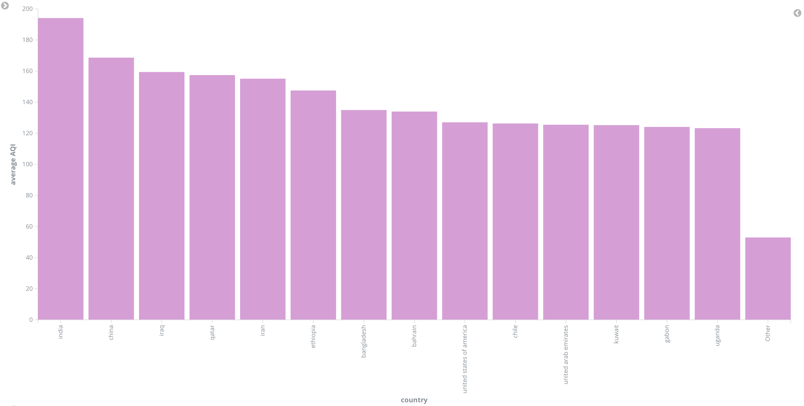

# Data Visualization - Presentation of Results

## Visualization 1

The graph displays the average AQI (Air Quality Index) values for each country. The highest AQI values are seen in India, China, and Iraq. As you move to the right, the values decrease, with the "Other" category showing significantly lower average AQI values than the rest.

## Visualization 2

The table shows three statistical indicators (average gross national income, HDI, and CO2 emissions) for each country. For example, the United Arab Emirates has high average income and CO2 emissions, while Uganda shows low values across all three categories.

## Visualization 3

This graph displays the capacity of power plants (in MW) across different countries, broken down by fuel type (coal, hydroelectric, gas, solar, wind, nuclear, oil). The largest capacities are seen in China, the United States, and India, with each country having significant differences in energy sources – for example, China has a dominant share of coal, while the USA has significant nuclear and gas capacities.

## Visualization 4

The line graph shows the development of the HDI (Human Development Index) in the top 20 countries from 2005 to 2020. Countries like Norway, Germany, and New Zealand consistently achieve high values, with an overall trend showing gradual improvement in most countries.

## Visualization 5

The heatmap shows the average life expectancy in the top 15 countries with the highest expected life expectancy from 2005 to 2020. The color scale represents different intervals of life expectancy, from light green (68–73 years) to dark green (82–87 years). Countries like Monaco, Japan, and Hong Kong show the highest values.

## Visualization 6

This widget shows the maximum recorded AQI values in 8 countries. The highest values are displayed for China (963) and the United Arab Emirates (868). These values indicate extreme levels of air pollution in these countries.

## Visualization 7

The area chart shows the median AQI values over time, with different color layers representing the contributions of different countries or regions. AQI values vary greatly, with some extreme peaks at certain times.

## Visualization 8

The pie chart represents the number of power plants by country. The largest shares are held by the United States, China, and India, which dominate the total number of power plants.